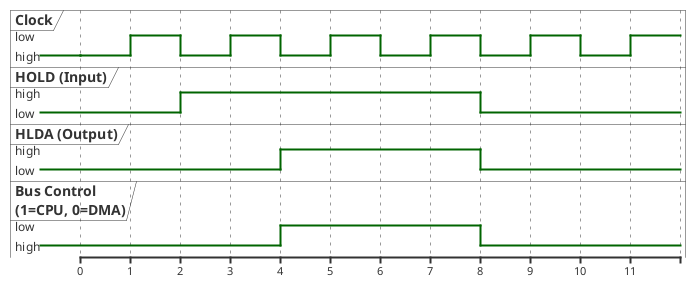

# Intel 8085

## Shared Bus Access (DMA)

* **HOLD** goes high first (DMA requests bus).
* After a delay, **HLDA** goes high (CPU acknowledges).
* **Bus Control** goes low (DMA has control).
* Once **HOLD** goes low, CPU regains control and HLDA drops.
