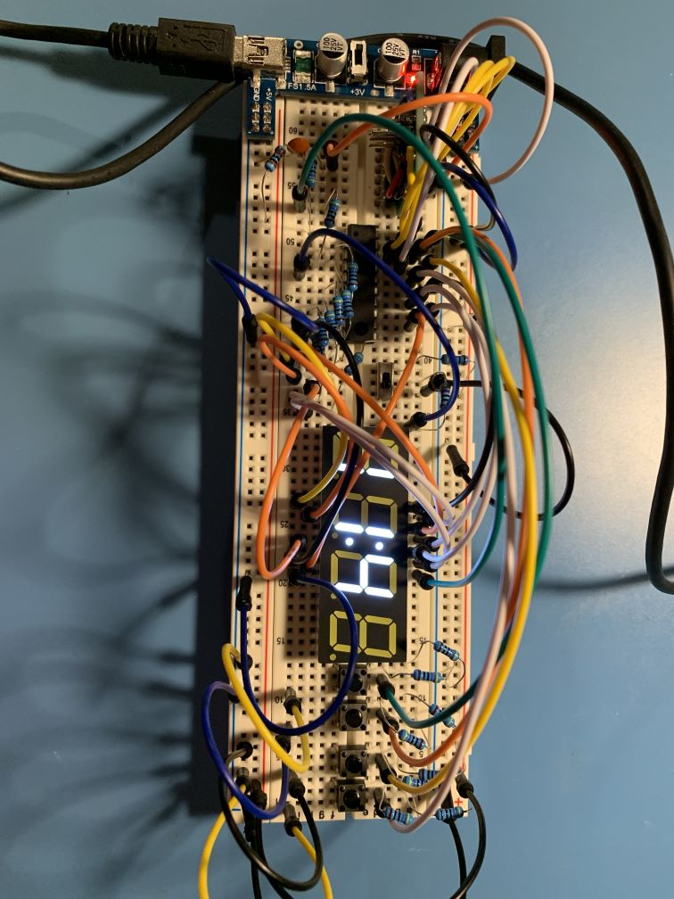
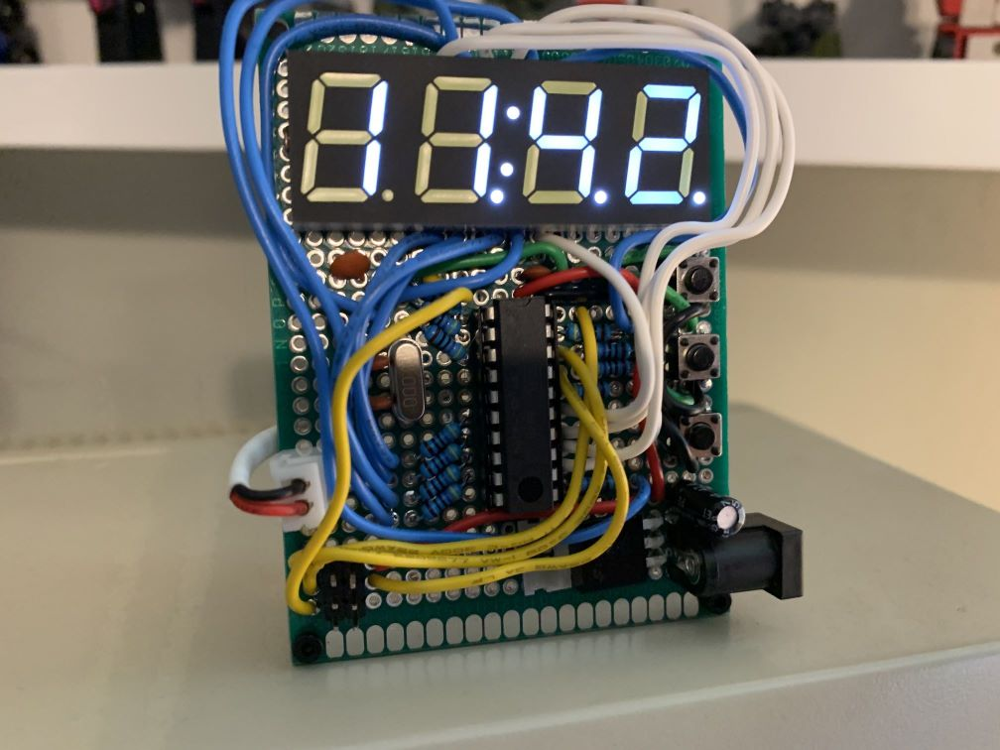

# Simple Clock - ATTiny2313

## Summary

Designed and programmed by Matthew Whited 2023-01-01.  This is a simple clock build around the ATTiny2313.

## Source and Designs

* Internal Clock
  * [Source Code](../../src/AVR/attiny2313/SimpleClock)
  * [Schematic](./SimpleClock) [(pdf)](./SimpleClock/SimpleClock.kicad_sch.pdf)
* External Clock
  * [Source Code](../../src/AVR/attiny2313/SimpleClockExt)
  * [Schematic](./SimpleClockExt) [(pdf)](./SimpleClockExt/SimpleClockExt.pdf)
