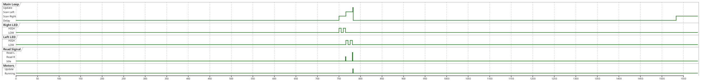
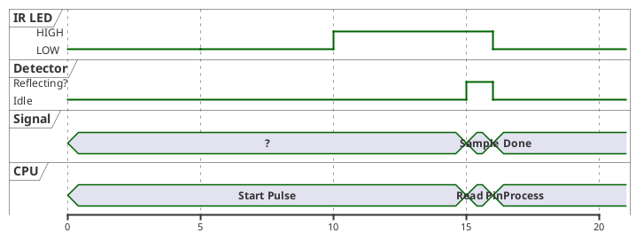

# Phase 2 AI - Obstacle Avoidance Robot (Refactored)

Modern refactored version using PlatformIO and modular C++.

Original by Matthew Whited - v0.1 - 12/29/2001

## Overview

A simple obstacle avoidance robot that uses infrared proximity detection to navigate around obstacles. The original PBASIC program has been refactored into a modular C++ project suitable for modern embedded development.

For the minimal direct port, see **Phase1/**.

## Hardware

| Component        | Description                           |
|------------------|---------------------------------------|
| MCU              | ATtiny2313 @ 1MHz (internal RC)       |
| IR Sensor        | Lynxmotion IRPD (IR Proximity Detector) |
| Motor Driver     | Dual Mini H-Bridge                    |
| Status LED       | Indicates backup mode                 |

## Project Structure

```
Phase2/
├── platformio.ini      # PlatformIO configuration
├── include/
│   ├── config.h        # Pin assignments and timing
│   ├── motor.h         # Motor driver interface
│   ├── irpd.h          # IRPD sensor interface
│   └── status.h        # Status LED interface
├── src/
│   ├── main.cpp        # Application entry point
│   ├── motor.cpp       # Motor driver implementation
│   ├── irpd.cpp        # IRPD sensor implementation
│   └── status.cpp      # Status LED implementation
├── README.md           # This file
└── IRPD_NOTES.md       # IRPD sensor documentation
```

## Pin Mapping

### Basic Stamp 2 to ATtiny2313 Adapter

```
BS2 Pin   Function              ATtiny2313    Arduino Pin   Physical Pin
-------   --------              ----------    -----------   ------------
Pin 0     IRPD Left LED         PD2           4             6
Pin 1     IRPD Right LED        PD3           5             7
Pin 2     IRPD Signal (input)   PD4           6             8
Pin 3     H-Bridge B1 (L Motor) PD5           7             9
Pin 4     H-Bridge B2 (L Motor) PD6           8             11
Pin 5     H-Bridge A1 (R Motor) PB0           9             12
Pin 6     H-Bridge A2 (R Motor) PB1           10            13
Pin 7     Status LED            PB2           11            14
```

### ATtiny2313 Pinout (20-pin DIP)

```
              +----U----+
(RESET) PA2  1|         |20  VCC
   (RX) PD0  2|         |19  PB7 (SCK)  - ISP
   (TX) PD1  3|         |18  PB6 (MISO) - ISP
        PA1  4|         |17  PB5 (MOSI) - ISP
        PA0  5|         |16  PB4
 IRPD_L PD2  6|         |15  PB3
 IRPD_R PD3  7|         |14  PB2  LED
 IRPD_S PD4  8|         |13  PB1  A2 (R)
 B1 (L) PD5  9|         |12  PB0  A1 (R)
        GND 10|         |11  PD6  B2 (L)
              +---------+
```

## Wiring Diagram for Perfboard Adapter

```
IRPD Connector:
  Left LED  -----> PD2 (pin 6)
  Right LED -----> PD3 (pin 7)
  Signal    -----> PD4 (pin 8)
  VCC       -----> VCC (pin 20)
  GND       -----> GND (pin 10)

H-Bridge Connector:
  B1 (Left)  -----> PD5 (pin 9)
  B2 (Left)  -----> PD6 (pin 11)
  A1 (Right) -----> PB0 (pin 12)
  A2 (Right) -----> PB1 (pin 13)

Status LED:
  Anode  -----> PB2 (pin 14) via 330-470 ohm resistor
  Cathode ----> GND

Power:
  VCC (5V) -----> Pin 20
  GND      -----> Pin 10

ISP Header (optional):
  MOSI  -----> PB5 (pin 17)
  MISO  -----> PB6 (pin 18)
  SCK   -----> PB7 (pin 19)
  RESET -----> PA2 (pin 1)
  VCC   -----> Pin 20
  GND   -----> Pin 10
```

## Motor Control Truth Table

| Action   | B1 (PD5) | B2 (PD6) | A1 (PB0) | A2 (PB1) | Left Motor | Right Motor |
|----------|----------|----------|----------|----------|------------|-------------|
| Stop     | LOW      | LOW      | LOW      | LOW      | Stop       | Stop        |
| Forward  | LOW      | HIGH     | HIGH     | LOW      | Forward    | Forward     |
| Backward | HIGH     | LOW      | LOW      | HIGH     | Backward   | Backward    |
| Spin R   | LOW      | HIGH     | LOW      | HIGH     | Forward    | Backward    |
| Spin L   | HIGH     | LOW      | HIGH     | LOW      | Backward   | Forward     |

## Build & Upload

### Prerequisites

Install [PlatformIO](https://platformio.org/):

```bash
pip install platformio
```

### Build

```bash
cd Phase2
pio run
```

### Upload

Configure your programmer in `platformio.ini`, then:

```bash
pio run --target upload
```

Supported programmers:
- `usbtiny` (default)
- `usbasp`
- `stk500v1`
- `arduinoisp`

### Configuration

Edit `include/config.h` to change pin assignments or `platformio.ini` to adjust timing:

```ini
build_flags =
    -D IRPD_PULSE_MS=5      ; IR LED pulse duration
    -D LOOP_DELAY_MS=750    ; Main loop delay
    -D STARTUP_DELAY_MS=1000 ; Power-on delay
```

## Algorithm

1. Wait for power stabilization (1 second)
2. Main loop:
   - Wait 750ms between scans
   - Pulse right IR LED and read detector
   - Pulse left IR LED and read detector
   - Determine action based on obstacles:

| Left Clear | Right Clear | Action     | LED |
|------------|-------------|------------|-----|
| Yes        | Yes         | Forward    | Off |
| No         | Yes         | Spin Right | Off |
| Yes        | No          | Spin Left  | Off |
| No         | No          | Backup     | On  |

## Timing Diagram

### Main Loop Timing



### IRPD Pulse Sequence Detail



### Timing Parameters

| Parameter        | Default | Description                              |
|------------------|---------|------------------------------------------|
| IRPD_PULSE_MS    | 5 ms    | Duration of each HIGH/LOW phase          |
| LOOP_DELAY_MS    | 750 ms  | Delay between sensor scans               |
| STARTUP_DELAY_MS | 1000 ms | Initial power-on stabilization delay     |
| Scan Duration    | ~32 ms  | Total time for both sensors (6 x 5ms + overhead) |

## Differences from Original

| Aspect          | Basic Stamp 2          | ATtiny2313/PlatformIO     |
|-----------------|------------------------|---------------------------|
| Language        | PBASIC                 | C++                       |
| Build System    | Stamp Editor           | PlatformIO                |
| Code Structure  | Single file, GOTOs     | Modular, functions        |
| Configuration   | Hardcoded              | Separate config.h         |
| Motor Commands  | Direct pin writes      | Abstraction layer         |
| Extensibility   | Limited                | Easy to add features      |

## License

Original Basic Stamp 2 code by Matthew Whited (2001).
ATtiny2313 port released under the same terms as the original.
