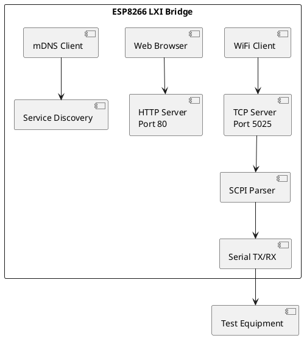

# LXI Serial Bridge

ESP8266-based LXI protocol bridge for serial test equipment.

## Description

Provides LXI (LAN eXtensions for Instrumentation) protocol support for test equipment that only has serial interfaces. This allows legacy serial instruments to be controlled over a network using standard SCPI clients.

## Features

- **SCPI Raw Socket Server** - TCP port 5025 (standard LXI port)
- **mDNS/DNS-SD Discovery** - Automatic instrument discovery
- **Serial Passthrough** - Bridges SCPI commands to serial port
- **Web Interface** - Configuration and status page
- **IEEE 488.2 Support** - Handles common commands (*IDN?, etc.)

## Hardware Requirements

- ESP8266 module (NodeMCU v2, ESP-12E, or D1 Mini)
- Serial connection to test equipment (TX, RX, GND)

## Build

This project uses PlatformIO.

```bash
# Build
pio run

# Upload
pio run --target upload

# Monitor serial output
pio device monitor
```

## Configuration

Edit `src/config.h` to configure:
- WiFi credentials
- Device name and identification
- Serial baud rate

## Usage

### VISA Resource String
```
TCPIP::<ip_address>::5025::SOCKET
```

### Bridge-Specific Commands
| Command | Description |
|---------|-------------|
| `BRIDGE:IP?` | Get bridge IP address |
| `BRIDGE:MAC?` | Get bridge MAC address |
| `BRIDGE:RSSI?` | Get WiFi signal strength |
| `BRIDGE:PASSTHROUGH?` | Query instrument *IDN? |

### Web Interface
Navigate to `http://<ip_address>/` for status and configuration.

## Architecture



## Pin Configuration

| Function | NodeMCU Pin |
|----------|-------------|
| Serial TX | TX |
| Serial RX | RX |
| Status LED | D4 (GPIO2) |
