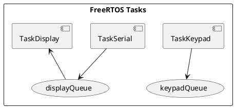

# Keypad/LCD Combo

## Summary

This device should have the ability to read from the serial read stream to update the LCD display as well as configure the keyboard mapping.

The Keypad values should be returned as USB HID keyboard commands to the USB host.

## Features

- FreeRTOS multitasking with separate tasks for serial, keypad, and display
- 4x12 matrix keypad scanning
- 20x4 I2C LCD display output
- USB HID keyboard emulation

## Hardware Requirements

- Arduino Leonardo or Pro Micro (ATmega32U4 for USB HID)
- 20x4 I2C LCD (address 0x27)
- Matrix keypad

## Pin Configuration

### Keypad Columns (Output)
| Column | Pin |
|--------|-----|
| 0      | A3  |
| 1      | A2  |
| 2      | A1  |
| 3      | A0  |

### Keypad Rows (Input with pullup)
Pins: 0, 1, 4, 5, 6, 7, 8, 9, 15, 14, 16, 10

## Dependencies

- Arduino_FreeRTOS
- hd44780
- Keyboard

## Architecture

