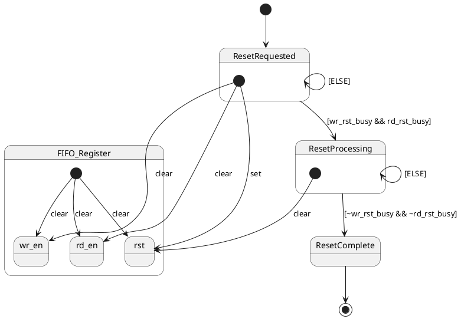
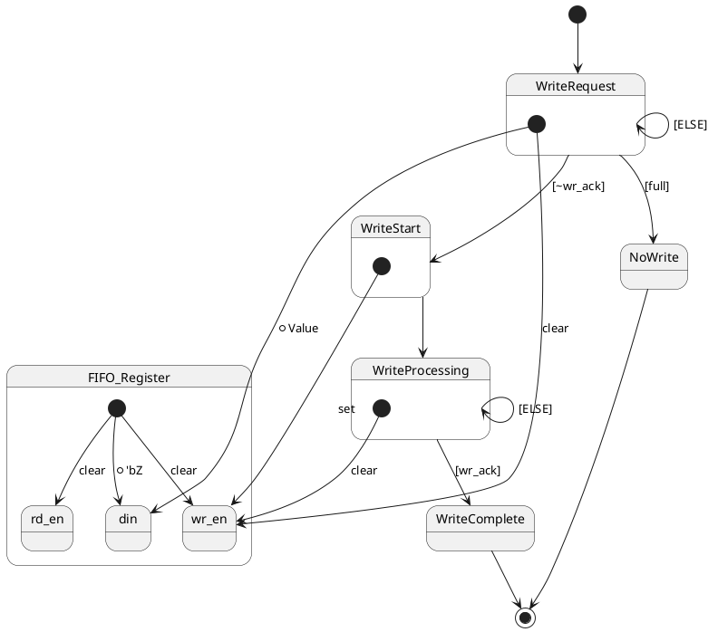
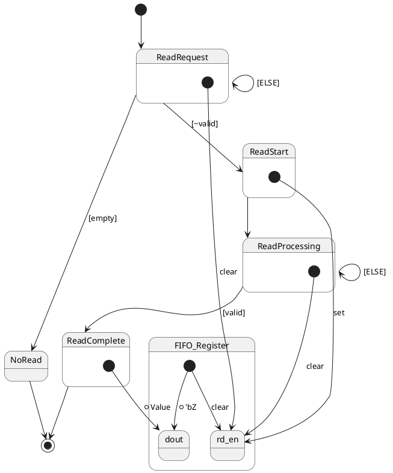

# XILINX FIO Generator - Native Interface

## Summary

The intent of this documnent is to describe the state flow of a XILINX Native FIFO with Independent Clocks

## Configuration

* Native Interface
* Independent Clocks
* Block RAM
* Write Acknowledgement
* Valid Flag
* Synchronized Reset

## Reset

## Write 

## Read

